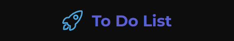
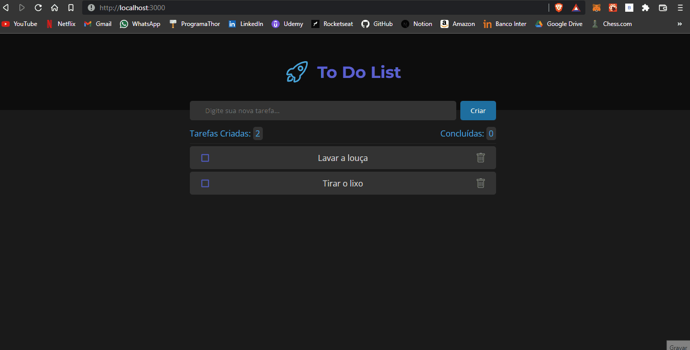

<h1 align="center">📓 To Do List 💻</h1>

 

<h3 align="center">Projeto desenvolvido como 1° desafio da trilha de React do Ignite!</h3>

 

---

_<h2>Demonstração 🎥</h2>_

---

_<h2>Mas, o que aprendi? 🤔</h2>_

#### Mesmo já tendo uma certa experiência em React, decidi fazer este desafio para consolidar conceitos, aplicar alguns novos e também aproveitei para dar os meus primeiros passos com o `TypeScript`!

---

_<h2>Como executar localmente ⚙️</h2>_

- Clone o projeto: `git clone "link do projeto"`.
- Execute o comando: `npm install` ou `yarn install`.
- E depois, execute `npm run dev` ou `yarn dev`.

#### Pronto! O Projeto já está rodando em `http://localhost:3000`.

---

 

